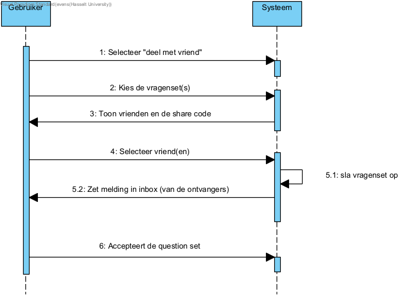
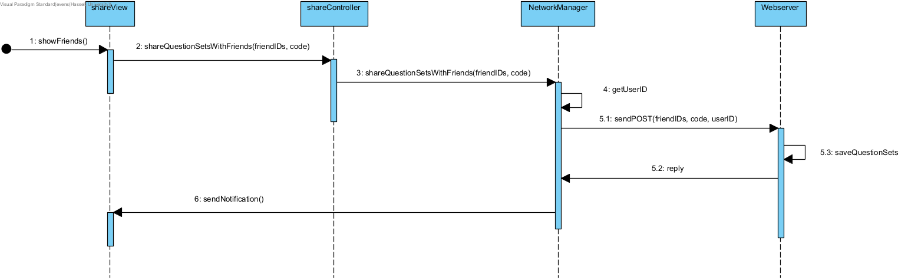

# Fully dressed use case deel vragen met vriend
**Use case:** Deel Vragen met Vrienden

**Scope:** Online en offline

**Level:** user-goal

**Primary Actors:**
* Student: Een gebruiker die vragen wil delen met een vriend.

**Stakeholders and Interests:**
* Student: Wil eenvoudig vragensets kunnen delen met vrienden
* Vriend (Ontvanger): Wil een gedeelde vragensets ontvangen (en kunnen gebruiken)

**Preconditions:**
1.	De Student (die wil delen) is ingelogd op het platform.
2.	De vragenset die gedeeld moet worden, is al aangemaakt en beschikbaar.

**Postconditions:** De vriend heeft de vragenset goed ontvangen en kan deze gebruiken.

**Main Success Scenario:**
1.	De student kiest de optie "Deel met vriend".		
2.	De Student kiest de gewenste vragenset(s) die hij/zij wil delen.
3.	Het systeem toont een lijst met vrienden en een “share code” wordt getoond
4.	De student selecteert een vriend(en) uit de lijst.
5.	Het systeem slaat de vragenset op en stuurt een melding naar de vriend(en) inbox
6.	De vriend ontvangt de melding in zijn/haar inbox 
7.	De vriend accepteert

**Uitbreidingen (Alternatieve Stromen):**   
3a. De vriend heeft geen account:
1.	De student kopieert de code
2.	De Student deelt de code via een extern kanaal (bv. e-mail of chat).
3.	De vriend voert de code in 
4.	Het systeem geeft toegang tot de gedeelde vragenset.

5a. Systeemfout bij opslaan van de vragenset:
1.	Het systeem kan de vragenset niet delen door een technische fout (bv. netwerkproblemen).
2.	Een foutmelding wordt weergegeven met uitleg en mogelijke oplossingen (bv. later opnieuw proberen).

7a: De vriend weigert de vragenset
1.	De vriend weigert de vragenset
2.	De melding in de inbox wordt verwijderd

**Special Requirements:**
1.	De code moet 10 tekens lang zijn om te vermijden dat andere gebruikers de code kunnen raden.
2.	De unieke vragenset code moet veilig gegenereerd worden en beperkt geldig zijn (bijvoorbeeld 48 uur).

**Technology and Data Variations List:** 
Geen

**Frequency of Occurences:**
Laag tot hoog, afhankelijk van hoe vaak vragensets worden gedeeld door gebruikers.

## Systeemsequentiediagram

## Contracten

### **Naam:** Optie "Deel met vriend" selecteren 
**Cross References:** 
* **Use cases:** Deel vragen met vriend 
* **SSD’s:** Deel vragen met vriend
  
**Pre-condities:** De gebruiker is ingelogd

**Post-condities:** 
* **Instance creation:** Er wordt een instantie gemaakt van een deel met vriend window

---

### **Naam:** Vragenset(s) selecteren 
**Cross References:** 
* **Use cases:** Deel vragen met vriend 
* **SSD’s:** Deel vragen met vriend
  
**Pre-condities:** Er zijn vragensets beschikbaar om te kunnen selecteren

**Post-condities:** 
* **Attribute modification:** De geselecteerde vragenset(s) worden gemarkeerd als "klaar om te delen".

---

### **Naam:** Lijst met vrienden en “share code” tonen 
**Cross References:** 
* **Use cases:** Deel vragen met vriend 
* **SSD’s:** Deel vragen met vriend
  
**Pre-condities:** De student heeft een vragenset geselecteerd.

**Post-condities:** 
* **Instance creation:** Er wordt een instantie gemaakt van een vrienden lijst window

---

### **Naam:** Vriend(en) selecteren  
**Cross References:** 
* **Use cases:** Deel vragen met vriend 
* **SSD’s:** Deel vragen met vriend
  
**Pre-condities:** Geen

**Post-condities:** 
* **Associations formed:** Een tijdelijke associatie wordt gemaakt tussen de geselecteerde vriend(en) en de te delen vragenset(s).

---

### **Naam:** Vragenset opslaan en melding verzenden 
**Cross References:** 
* **Use cases:** Deel vragen met vriend 
* **SSD’s:** Deel vragen met vriend
  
**Pre-condities:** De gebruiker heeft minstens één vriend geselecteerd

**Post-condities:** 
* **Instance creation:** Er wordt een inbox-item aangemaakt in het systeem.
* **Associations formed:** De notificatie wordt gekoppeld aan de inbox van de geselecteerde vriend(en).

---

### **Naam:** Notificatie ontvangen in inbox 
**Cross References:** 
* **Use cases:** Deel vragen met vriend 
* **SSD’s:** Deel vragen met vriend
  
**Pre-condities:** De notificatie is succesvol verzonden

**Post-condities:** 
* **Instance creation:** De notificatie verschijnt in de inbox van de geselecteerde vriend(en).

---

### **Naam:** Notificatie accepteren 
**Cross References:** 
* **Use cases:** Deel vragen met vriend 
* **SSD’s:** Deel vragen met vriend
  
**Pre-condities:** De vriend heeft de notificatie in zijn/haar inbox ontvangen.

**Post-condities:** 
* **Associations broken:** De verbinding wordt verbroken en de notificatie wordt verwijderd 
* **Instance creation:** De vragenset wordt lokaal opgeslagen op het systeem van de vriend

## UML Diagrammen ontwerp
De gebruiker heeft al een vragen set(s) gekozen om te vesturen. De gebruiker selecteert nu naar welke vrienden dit verstuurt moet worden.
 

## Klassen diagram
