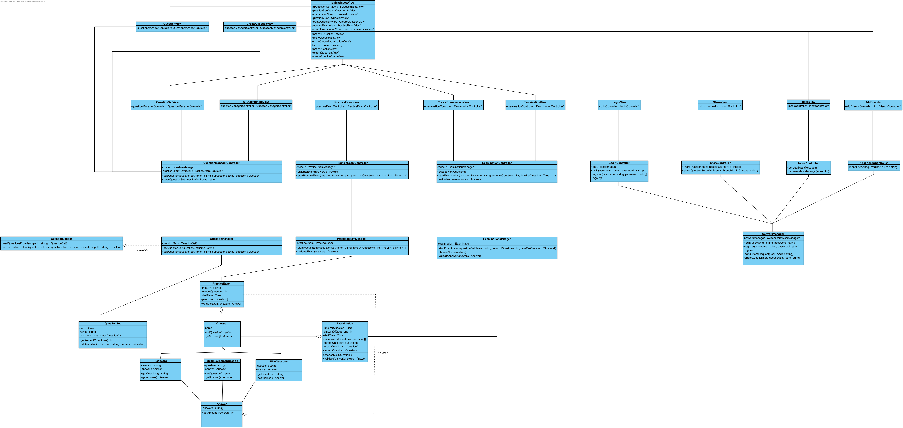

## Fully dressed use case
**Use case:** Maak vak aan

**Scope:** Applicatie GUI en backend

**Level:** User goal

**Primary Actor:** Docent

**Stakeholders and interests:**
* Docent: wil wak aanmaken om officiele proefexamens te delen met studenten

**Preconditions:**
1. Gebruiker die het vak wilt aanmaken dient een docent account te hebben en hierop ingelogd te zijn

**Postconditions:** Vak is aangemaakt

**Main Success Scenario:**
1. Gebruiker wilt vak aanmaken
2. Gebruiker navigeert naar vakken
3. Gebruiker kiest om een vak aan te maken
4. Gebruiker voert vaknaam in
5. Gebruiker maakt vak aan

**Uitbreidingen (Alternatieve Stromen):**  
4a. Fout met vaknaam, zoals een te lange naam:
1. Gebruiker wordt vermeld dat hij een andere vaknaam moet ingeven.

5a. Vak kan niet aangemaakt worden:
1. Gebruiker wordt op de hoogte gebracht

**Special Requirements:** Geen

**Technology and Data Variations List:** Geen

**Frequency of Occurences:** Laag, er wordt verondersteld dat vakken eenmalig aangemaakt worden voor veel gebruik

## Systeemsequentiediagram

## Contracten
### **Naam:** Open vakscherm 
**Cross References:** 
* **Use cases:** Maak vak aan 
* **SSD’s:** Maak vak aan
  
**Pre-condities:** De gebruiker dient ingelogd te zijn op een docent account 
**Post-condities:** 
* **Instance creation:** Een vakscherm instantie wordt aangemaakt

---

### **Naam:** Kies optie om vak toe te voegen 
**Cross References:** 
* **Use cases:** Maak vak aan 
* **SSD’s:** Maak vak aan
  
**Pre-condities:** Het vakscherm dient open te zijn 
**Post-condities:** 
* **Instance creation:** Een textveld wordt getoond waar de vaknaam ingediend wordt

---
### **Naam:** Vul vaknaam in 
**Cross References:** 
* **Use cases:** Maak vak aan 
* **SSD’s:** Maak vak aan
  
**Pre-condities:** Het textveld voor de vaknaam in te geven dient open te zijn 
**Post-condities:** 
* **Attribute modification:** Locaal wordt de naam opgeslagen
---

### **Naam:** Bevestig aanmaak 
**Cross References:** 
* **Use cases:** Maak vak aan 
* **SSD’s:** Maak vak aan
  
**Pre-condities:** Het invulveld moet open zijn 
**Post-condities:** 
* **Attribute modification:** 

---
### **Naam:** Geef correcte feedback 
**Cross References:** 
* **Use cases:** Maak vak aan 
* **SSD’s:** Maak vak aan
  
**Pre-condities:** Het aanmaken van het vak moet bevestigd zijn 
**Post-condities:** 
* **Attribute modification:** Er wordt gekeken of het ingevulde veld correct is, zo ja wordt de info naar de server gestuurd. Zo nee krijgt de gebruiker dat te weten.
* **Instance destruction:** Het invulveld wordt gesloten

---

## UML Diagrammen ontwerp

## Klassen diagram

