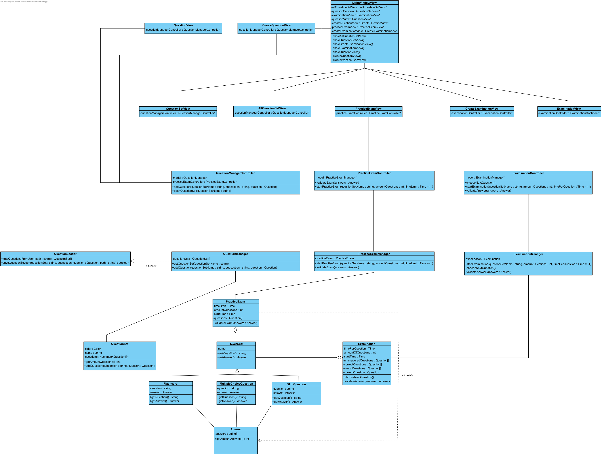

# Fully dressed use case genereer proefexamen
**Use case:** Docent voegt officieel proefexamen toe aan een vak

**Scope:** Applicatie GUI en backend

**Level:** User goal

**Primary Actor:** Docent

**Stakeholders and interests:**
* Docent: Wil studenten voorzien van proefexamens voor studietraining en hun eventueel te kunnen bijsturen.

**Preconditions:** Er bestaat minstens één opgeslagen proefexamen en docent is deel van het onderwijsteam van het vak

**Postconditions:** Het proefexamen is toegevoegd aan het vak

**Main Success Scenario:**

1. De gebruiker selecteert de optie “Voeg proefexamen toe”
2. Het systeem toont de opgeslagen proefexamens
3. De gebruiker selecteert het proefexamen naar keuze 
4. Het proefexamen wordt toegevoegd aan het vak

**Uitbreidingen (Alternatieve Stromen)**

4a. ER gaat iets mis met het toevoegen
1. De gebruiker wordt hiervan verwittigd

**Special Requirements:** 

**Technology and Data Variations List:** Geen

**Frequency of Occurences:** Dit wordt af en toe gebruikt als een docent vindt dat de al bestaande proefexamens niet meer van toepassing zijn.

## Systeem Sequentie Diagram

## Contracten

### **Naam:** Open vakscherm 
**Cross References:** 
* **Use cases:** Docent voegt officieel proefexamen toe aan een vak 
* **SSD’s:** Voeg proefexamen toe aan vak
  
**Pre-condities:** De gebruiker moet ingelogd zijn op een docent account 
**Post-condities:** 
* **Instance creation:** Een vakscherm instantie wordt aangemaakt

---

### **Naam:** Selecteer het gewenste vak 
**Cross References:** 
* **Use cases:** Docent voegt officieel proefexamen toe aan een vak 
* **SSD’s:** Voeg proefexamen toe aan vak
  
**Pre-condities:** Er moet minstens 1 vak zijn waar de docent toegang toe heeft 
**Post-condities:** 
* **Instance destruction:** Het vakscherm wordt gesloten
* **Instance creation:** Een scherm voor het specifieke vak wordt aangemaakt

---

### **Naam:** Selecteer proefexamen toevoegen 
**Cross References:** 
* **Use cases:** Docent voegt officieel proefexamen toe aan een vak 
* **SSD’s:** Voeg proefexamen toe aan vak
  
**Pre-condities:** Het scherm voor het specifieke vak moet open zijn 
**Post-condities:** 
* **Instance creation:** Een proefexamen selecteer instance wordt aangemaakt

---

### **Naam:** Presenteer de opgeslagen proefexamens 
**Cross References:** 
* **Use cases:** Docent voegt officieel proefexamen toe aan een vak 
* **SSD’s:** Voeg proefexamen toe aan vak
  
**Pre-condities:** De proefexamen selecteer instance moet aangemaakt zijn 
**Post-condities:** 
* **Instance modification:** De opgeslagen proefexamens worden getoond in de proefexamen selecteer instance.

---

### **Naam:** Selecteer het gewenste proefexamenk 
**Cross References:** 
* **Use cases:** Docent voegt officieel proefexamen toe aan een vak 
* **SSD’s:** Voeg proefexamen toe aan vak
  
**Pre-condities:** Er moet minsstens 1 preofexamen opgeslagen zijn 
**Post-condities:** 
* **Attribute modification:** Het geselecteerde proefexamen wordt opgestuurd naar de server

---

### **Naam:** Geef correcte feedback 
**Cross References:** 
* **Use cases:** Docent voegt officieel proefexamen toe aan een vak 
* **SSD’s:** Voeg proefexamen toe aan vak
  
**Pre-condities:** Er moet een proefexamen geselecteerd zijn 
**Post-condities:** 
* **Attribute modification:** De gebruiker krijgt een melding als er iets is fout gegaan
* **Instance modification:** Het specifieke vakscherm wordt geupdate met het nieuwe proefexamen als er niks fout ging
---

## UML Diagrammen ontwerp
 

## Klassen diagram
