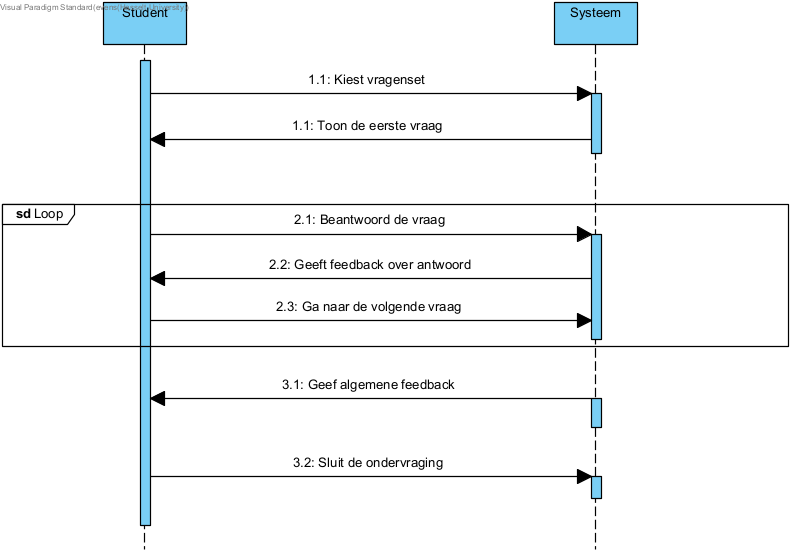
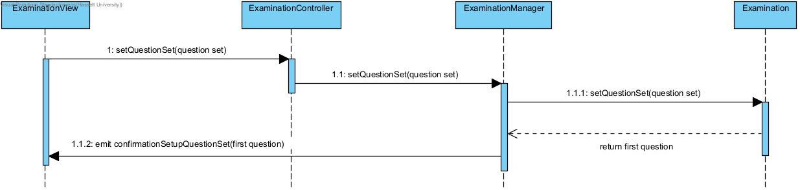
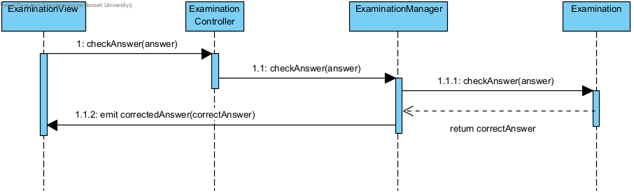
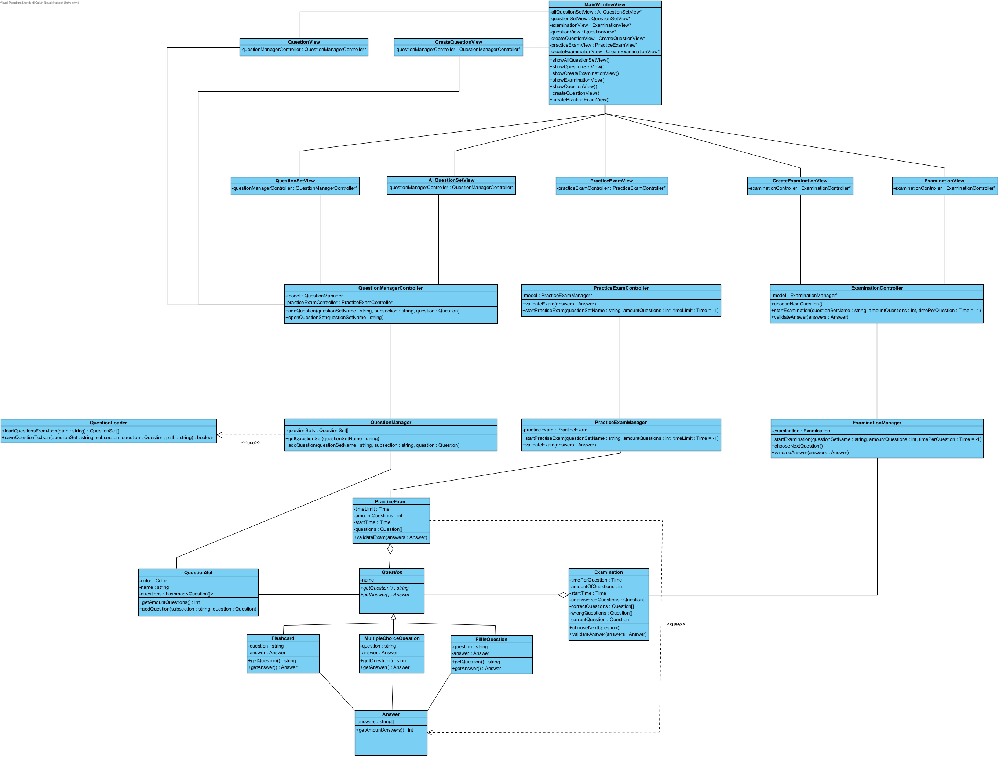

# Fully dressed use case doorloop vragen
**Use case:** Doorloop vragen 

**Scope:** Offline deel van Leerhulpmiddel

**Level:** user-goal

**Primary Actor:** Student of Docent

**Stakeholders and interests:** 
* Student: Wil makkelijk door de vragen kunnen gaan en feedback krijgen op hun antwoorden om dit te kunnen studeren.
* Onderwijssysteem: Wil dat student goed studeert, zodat hij/zij goed op toetsen doet.

**Preconditions:** Vragen dienen aangemaakt te zijn voordat deze doorlopen kunnen worden

**Postconditions:** Student heeft de ondervraging of het proefexamen volledig doorgelopen en heeft de vragen behandeld en beantwoord indien nodig

**Main Success Scenario:**
1. De student kiest een vragenset waar ze vragen van willen studeren
2. Het systeem geeft de gebruiker een vraag om te beantwoorden
3. De gebruiker bekijkt de vraag
4. De gebruiker geeft een antwoord op de vraag 
5. Systeem geeft feedback op het antwoord
6. De gebruiker gaat naar volgende vraag

Herhaal deze stappen totdat je alle vragen hebt beantwoord.

7. Systeem geeft algemeen feedback over beantwoorde vragen
8. De gebruiker sluit de ondervraging af

**Uitbreidingen (Alternatieve Stromen):**

*a. De ingestelde timer voor het proefexamen loopt af:
1. Het systeem stopt het proefexamen
2. De gebruiker krijgt de antwoorden op de vragen te zien.
3. De gebruiker sluit het proefexamen af.

*b. De ingestelde timer per vraag loopt af:
1. De gebruiker kan deze vraag niet meer beantwoorden.
2. De gebruiker krijgt het antwoord van de vraag te zien.
3. De gebruiker gaat verder met de rest van de ondervraging.

1a. De gebruiker heeft een tijdslimiet ingestelt voor iedere vraag van een ondervraging:
1. Het systeem vermeld aan de gebruiker dat de ingegeven timer per vraag telt.
2. De gebruiker bevestigt de timer.
3. Het systeem stelt de timer in.

1b. De student is bezig met een proefexamen:
1. De gebruiker kan tussen vragen navigeren naar eigen wil (vooruit, teruggaan, etc. zoals in een echt examen).
2. Na het beantwoorden van alle vragen beeindigt de gebruiker de ondervraging.

1c. De gebruiker stelt een tijdslimiet in voor het proefexamen:
1. Het systeem vermeld aan de gebruiker dat de ingegeven timer voor het hele proefexamen telt.
2. De gebruiker bevestigt de timer.
3. Het systeem stelt de timer in.

2a. De gebruiker slaat de vraag over:
1. De gebruiker is een ondervraging bezig, de vraag wordt fout gerekend: 
	1a. Indien de gebruiker een proefexamen aan het maken is:
      1. De gebruiker kan navigeren naar een andere vraag naar keuze
      2. De gebruiker kan deze later beantwoorden door hier opnieuw na te navigeren

5a. Indien de vraag van het type flashcard is:
1. De gebruiker geeft systeem eigen feedback van hoe vraag is gegaan.

6a. Er zijn geen volgende vragen meer:
1. De gebruiker eindigt ondervraging

**Special Requirements:**
De volgende vraag dient binnen de 100ms getoond te worden

**Technology and Data Variations List:**
Geen

**Frequency of Occurences:** 
Dit wordt frequent gebruikt, namelijk wanneer de gebruiker studeert aan de hand van ondervragingen of oefenexamens

## Systeemsequentiediagram

## Contracten

### **Naam:** Kies vragenset 
**Cross References:** 
* **Use cases:** Doorloop vragen 
* **SSD’s:** Doorloop vragen
  
**Pre-condities:** Er bestaat minstens 1 vragenset die kan geselecteerd worden en deze bevat minstens 1 vraag 
**Post-condities:** 
* **Associations formed:** De geselecteerde vragenset wordt gekoppeld aan de ondervraging
* **Instance creation:** Een ondervraging instantie wordt aangemaakt.

---

### **Naam:** Beantwoord de vraag 
**Cross References:** 
* **Use cases:**  Doorloop vragen 
* **SSD’s:** Doorloop vragen
  
**Pre-condities:** De huidige vraag is geladen en weergegeven aan de gebruiker.
**Post-condities:** 
* **Attribute modification:** Het gebruiker gegenereerde antwoord wordt opgeslagen.

---

### **Naam:** Ga naar de volgende vraag 
**Cross References:** 
* **Use cases:** Doorloop vragen 
* **SSD’s:** Doorloop vragen
  
**Pre-condities:** 
* De huidige vraag is beantwoord door de gebruiker.
* Er is een volgende vraag beschikbaar om te tonen

**Post-condities:** 
* **Attribute modification:** De voortgang van de ondervraging wordt bijgewerkt (Vraagnummer).
* **Associations formed:** De nieuwe vraag wordt gekoppeld aan de ondervraging.
* **Associations broken:** De vorige vraag wordt losgekoppeld van de huidige ondervraging zodra deze beantwoord is.

---

### **Naam:** Sluit de ondervraging  
**Cross References:** 
* **Use cases:** Doorloop vragen 
* **SSD’s:** Doorloop vragen
  
**Pre-condities:** De ondervraging is gestart.

**Post-condities:** 
* **Association broken:** De verbinding tussen vragenset en de ondervraging wordt onderbroken
* **Instance creation:** Er wordt een eindverslag van de ondervraging aangemaakt 

## UML Diagrammen ontwerp
De gebruiker kiest de vragenset die ze willen gebruiken voor hun ondervraging
 
Dit toont de system flow wanneer de gebruiker een vraag in de ondervraging beantwoord en hoe ze het correct resultaat krijgen weergegeven.

## Klassen diagram
