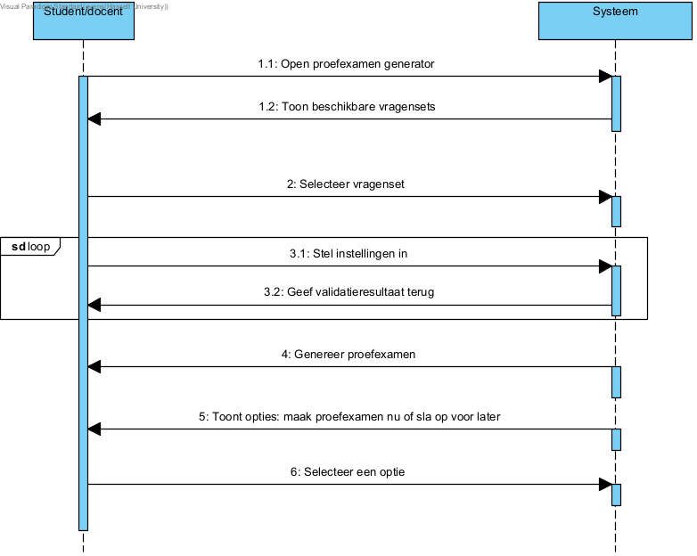

# Fully dressed use case genereer proefexamen
**Use case:** genereer proefexamen

**Scope:** Offline deel van Leerhulpmiddel

**Level:** User goal

**Primary Actor:** Student of Docent

**Stakeholders and interests:**
* Student: Wil een proefexamen maken met een specifieke set vragen om kennis te testen en te oefenen voor een aankomend examen.
* Docent: Wil studenten voorzien van proefexamens voor studietraining en hun eventueel te kunnen bijsturen.

**Preconditions:** Er bestaat minstens één vragenset met vragen waar vragen van kunnen genomen worden

**Postconditions:** Het proefexamen is gegenereerd en kan door de gebruiker worden bekeken en/of opgeslagen

**Main Success Scenario:**

1. De gebruiker selecteert de optie “Genereer proefexamen”
2. Het systeem toont alle beschikbare vragensets waaruit de gebruiker kan kiezen
3. De gebruiker selecteert de vragenset naar keuze 
4. De gebruiker stelt alle instellingen in zoals tijd en aantal vragen. (Let op: de gebruiker kan niet meer vragen selecteren als dat er vragen zijn in de geselecteerde vragenset)
5. Het systeem controleert of alle ingegeven velden correct zijn.
6. Het systeem genereert een proefexamen op basis van de geselecteerde vragenset en het aantal vragen.
7. De gebruiker krijgt de optie om het proefexamen te maken of deze opslaan en later te maken.
8. De gebruiker selecteert een optie (zie alternatieve scenario’s hieronder)

**Uitbreidingen (Alternatieve Stromen)**

8a. De gebruiker kiest opslaan:
1. ze moeten kiezen waar ze dit willen opslaan, ofwel als online backup ofwel lokaal opslaan.
2. Het systeem slaat het proefexamen op in de database.
3. Bij succesvolle opslag ontvangt de gebruiker een bevestiging.

8b. De gebruiker kiest om het proefexamen te maken:
1. De gebruiker begint deze dan te maken

5a. De gebruiker laat een van de instelling velden open:
1. Het systeem toont een foutmelding en vraagt de gebruiker om de ontbrekende elementen in te vullen.

6a. De gebruiker heeft ook een timer ingesteld:
1. Het systeem genereert deze dan ook voor het proefexamen

**Special Requirements:** 
* Het systeem moet binnen 1 seconde reageren op gebruikersacties, zoals het selecteren van de vragenset of het opgeven van het aantal vragen.
* Het gegenereerde proefexamen moet worden gepresenteerd in een duidelijk overzicht met vraagnummering en eventuele timerindicatie.

**Technology and Data Variations List:** Geen

**Frequency of Occurences:** Dit wordt af en toe eens gebruikt, de frequentie van gebruik is afhankelijk hoe vaak de student zijn leerstof zo wilt inoefenen en hoeveel examens de docent wilt samenstellen.

## Systeem Sequentie Diagram

