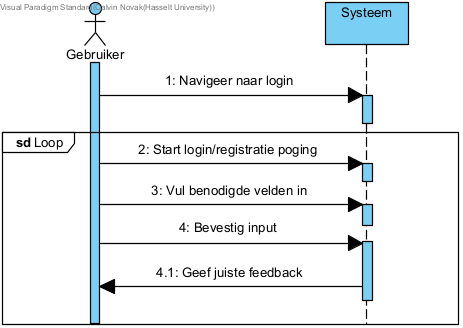
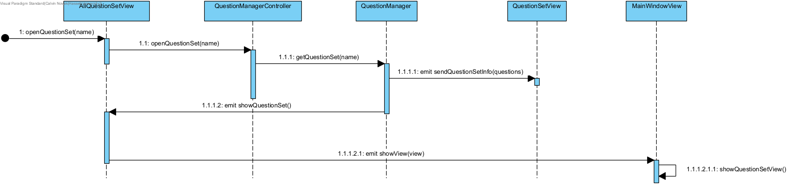
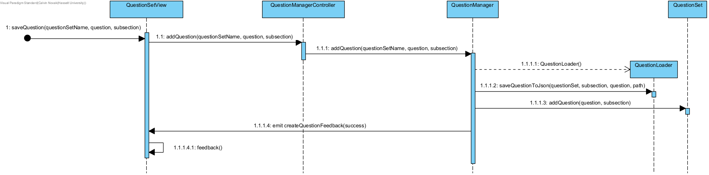

## Fully dressed use case
**Use case:** Login

**Scope:** Connectie tussen applicatie en server

**Level:** User goal

**Primary Actor:** Student of Docent

**Stakeholders and interests:**
* Student en docent: Wilt kunnen inloggen om online features te gebruiken

**Preconditions:** Applicatie is opgestart.

**Postconditions:** Gebruiker is ingelogd en heeft toegang tot online features.

**Main Success Scenario:**

1. De gebruiker wilt online features gebruiken dus probeert in te loggen.
2. De gebruiker navigeert naar de login.
3. De gebruiker geeft hun username en wachtwoord in.
4. De gebruiker is ingelogd.

**Uitbreidingen (Alternatieve Stromen)**

3a. De gebruiker heeft nog geen account: 

    1. De gebruiker navigeert naar registratie
    2. De gebruiker geeft een username en wachtwoord in

        2a. De username is ongeldig of al in gebruik:
            1. De gebruiker kiest een andere username 

        2b. Het wachtwoord voldoet niet aan de vereisten: 
            1. De gebruiker kiest een ander wachtwoord

4a. De login gegevens zijn fout:

    1. De gebruiker wordt niet ingelogd
    2. De gebruiker wordt op de hoogte gebracht

**Special Requirements:** Geen

**Technology and Data Variations List:** Geen

**Frequency of Occurences:** Dit wordt redelijk frequent uitgevoerd door studenten en docenten die vragen willen maken om te willen leren/delen.

## Systeemsequentiediagram

## Contracten
### **Naam:** Navigeer naar login 
**Cross References:** 
* **Use cases:** Login 
* **SSD’s:** Login
  
**Pre-condities:** Geen 
**Post-condities:** 
* **Instance creation:** GUI login werd getoond 

---

### **Naam:** Start login/registratie poging 
**Cross References:** 
* **Use cases:** Login 
* **SSD’s:** Login
  
**Pre-condities:** Loginpagina dient open te zijn 
**Post-condities:** 
* **Instance creation:** GUI login of registratie werd getoond 

---

### **Naam:** Vul benodigde velden in 
**Cross References:**
* **Use cases:** Login 
* **SSD’s:** Login
  
**Pre-condities:** GUI login/ registratie dient open te zijn 
**Post-condities:** 
* **Attribute modification:** Login gegevens opgeslaan in tekstvak 

---

### **Naam:** Bevestig input 
**Cross References:**
* **Use cases:** Login 
* **SSD’s:** Login
  
**Pre-condities:** GUI login/ registratie dient open te zijn 
**Post-condities:** 
* **Association formed:** Database wordt gecheckt voor correctheid input 

## UML Diagrammen ontwerp
Open vragenset toont de system flow wanneer er een vragenset wordt geopend door de gebruiker.

Sla vraag op toont de system flow wanneer er een vraag wordt opgeslagen.

## Klassen diagram

