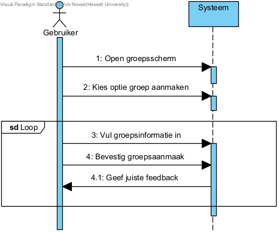
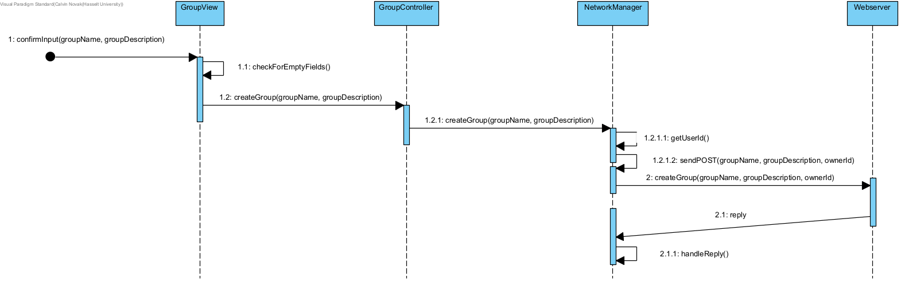

## Fully dressed use case
**Use case:** Maak groep aan

**Scope:** Applicatie GUI en backend

**Level:** User goal

**Primary Actor:** Student of Docent

**Stakeholders and interests:**
* Docent: wil groep aanmaken om studenten uit te nodigen en content met hun te delen
* Student: wil groep aanmaken om met vrienden content te delen

**Preconditions:**
1. Gebruiker die groep wilt aanmaken dient een account te hebben en hierop ingelogd te zijn

**Postconditions:** Groep is aangemaakt

**Main Success Scenario:**
1. Gebruiker wilt groep aanmaken
2. Gebruiker navigeert naar groepen
3. Gebruiker kiest om groep aan te maken
4. Gebruiker voert groepsnaam in
5. Gebruiker maakt groep aan

**Uitbreidingen (Alternatieve Stromen):**   
4a. De gebruiker wil meer info toevoegen:
1. Gebruiker voert beschrijving in

**Special Requirements:** Geen

**Technology and Data Variations List:** Geen

**Frequency of Occurences:** Laag, er wordt verondersteld dat groepen eenmalig aangemaakt worden voor veel gebruik

## Systeemsequentiediagram

## Contracten
### **Naam:** Open groepsscherm 
**Cross References:** 
* **Use cases:** Maak groep aan, Nodig gebruikers uit tot groep 
* **SSD’s:** Maak groep aan, Nodig gebruikers uit tot groep
  
**Pre-condities:** Gebruiker is ingelogd 
**Post-condities:** 
* **Instance creation:** Groepen scherm word getoond 

---

### **Naam:** Kies optie groep aanmaken 
**Cross References:** 
* **Use cases:** Maak groep aan 
* **SSD’s:** Maak groep aan 
  
**Pre-condities:** Groepen scherm dient geopend te zijn 
**Post-condities:** 
* **Instance creation:** Scherm groep aanmaken wordt getoond 

---

### **Naam:** Vul groepsinformatie in 
**Cross References:** 
* **Use cases:** Maak groep aan 
* **SSD’s:** Maak groep aan
  
**Pre-condities:** Groep aanmaken scherm dient getoond te zijn 
**Post-condities:** 
* **Attribute modification:** Groepsinformatie wordt opgeslagen in tekstvakken 

---

### **Naam:** bevestig groepsaanmaak 
**Cross References:** 
* **Use cases:** Maak groep aan 
* **SSD’s:** Maak groep aan
  
**Pre-condities:** Groepsinformatie dient ingevoerd te zijn 
**Post-condities:** 
* **Instance creation:** Groep wordt aangemaakt 

## UML Diagrammen ontwerp
Bevestig groepsaanmaak toont de system flow wanneer de user een groep wilt aanmaken, de applicatie zal hiervoor een request sturen naar onze webserver.

## Klassen diagram

