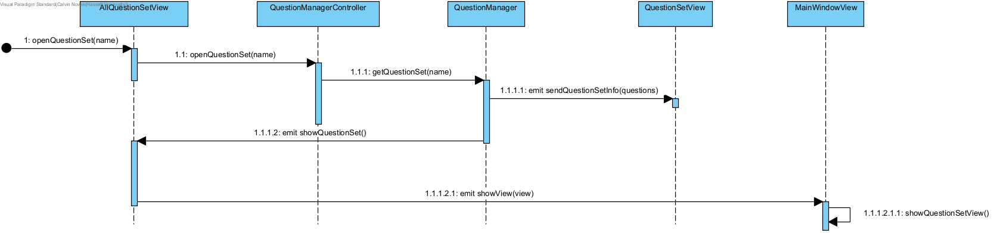

## Fully dressed use case
**Use case:** Maak vragenset

**Scope:** Offline deel van Leerhulpmiddel

**Level:** User goal

**Primary Actor:** Student of Docent

**Stakeholders and interests:**
* Student: Wenst een vragenset aan te maken om vervolgens zijn gemaakte vragen geordend te houden onder de juiste vragenset.
* Docent: Wenst een vragenset aan te maken om de vragen die hij gaat delen met zijn studenten geordend te houden

**Preconditions:** Geen

**Postconditions:** De vragenset is succesvol gemaakt en is gereed voor vragen erin te zetten.

**Main Success Scenario:**

1. De gebruiker vult een naam in voor de vragenset.
2. De gebruiker kiest een kleur voor aan de vragenset te geven.
3. Het systeem controleert of de ingegeven velden correct zijn.
4. Het systeem slaat de vragenset op in de lokale database.
5. Bij succesvolle opslag krijgt de gebruiker een bevestiging.
6. De vragenset is aangemaakt en gereed voor er vragen in te zetten.

**Uitbreidingen (Alternatieve Stromen)**

3a. Ongeldige of lege invoer:
1. Het systeem toont een foutmelding en vraagt de gebruiker om de foutieve velden aan te passen.

5a. Opslag fout (bv. bij een volle schijf):
1. De gebruiker wordt vermeld wat er fout ging tijdens het opslaan en wordt gevraagd om het opnieuw te proberen.

**Special Requirements:** De aangeboden kleuren moeten duidelijk onderscheidbaar zijn voor de gebruiker zodat deze snel en op basis van kleur zijn vragenset kan vinden. 

**Technology and Data Variations List:** Geen

**Frequency of Occurences:** Dit wordt zelden gebruikt. Als de gebruiker initieel al zijn vragensets heeft gemaakt zal hij zelden een nieuwe maken.

## Systeemsequentiediagram

## Contracten

### **Naam:** Begin aanmaak nieuwe vragenset 
**Cross References:** 
* **Use cases:** Maak vragenset 
* **SSD’s:** Maak vragenset
  
**Pre-condities:** Geen 
**Post-condities:** 
* **Instance creation:** GUI vragenset aanmaken wordt getoond. 

---

### **Naam:** Gebruiker vult gegevens vragenset in 
**Cross References:** 
* **Use cases:** Maak vragenset 
* **SSD’s:** Maak vragenset
  
**Pre-condities:** GUI vragenset aanmaken dient geopend te zijn. 
**Post-condities:** 
* **Attribute modification:** Naam en kleur worden bepaald. 

---

### **Naam:** Sla vragenset op 
**Cross References:** 
* **Use cases:** Maak vragenset 
* **SSD’s:** Maak vragenset
  
**Pre-condities:** 
* GUI vragenset aanmaken dient geopend te zijn. 
* Ingegeven velden dienen correct te zijn.<br\>

**Post-condities:** 
* **Instance creation:** Vraag wordt opgeslagen. 

## UML Diagrammen ontwerp

