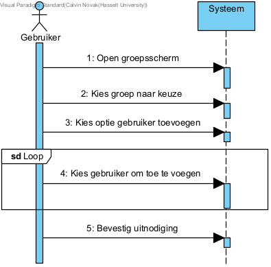
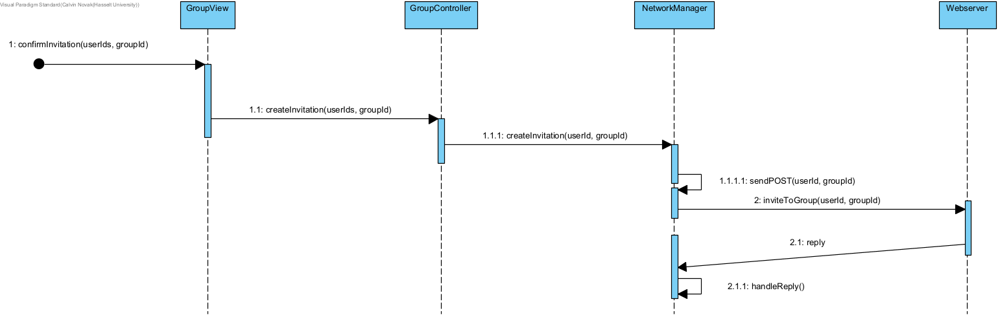

## Fully dressed use case
**Use case:** Nodig gebruikers uit tot groep

**Scope:** Applicatie GUI en backend

**Level:** User goal

**Primary Actor:** Student of Docent

**Stakeholders and interests:**
* Docent: wil studenten uitnodigen tot bestaande groep om content met hun te delen
* Student: wil vrienden uitnodigen tot bestaande groep om content te delen

**Preconditions:** 
1. Groep dient aangemaakt te zijn
2. User die andere users wilt uitnodigen dient eigenaar te zijn van de groep

**Postconditions:** Users ontvangen groepsuitnodiging

**Main Success Scenario:**
1. De groepseigenaar wilt leden aan de groep toevoegen
2. De user gaat naar het groepenscherm
3. De user navigeert naar de gewilde groep
4. De user selecteert de optie om users uit te nodigen
5. De users kiest de users die uitgenodigd moeten worden via vriendenlijst
6. De user nodigt de geselecteerde users uit tot de groep

**Uitbreidingen (Alternatieve Stromen):**   
5a. De uitgenodigden zijn geen vrienden:
1. De user kiest de optie om een groepscode te genereren
2. De user bezorgt de code via een extern platform

**Special Requirements:** 
1.	De code moet 10 tekens lang zijn om te vermijden dat andere gebruikers de code kunnen raden.
2.	De unieke groepen code moet veilig gegenereerd worden en beperkt geldig zijn (bijvoorbeeld 48 uur).

**Technology and Data Variations List:** Geen

**Frequency of Occurences:** Laag tot hoog, afhankelijk van hoe vaak er nieuwe groepsleden zijn

## Systeemsequentiediagram

## Contracten
### **Naam:** Open groepsscherm 
**Cross References:** 
* **Use cases:** Maak groep aan, Nodig gebruikers uit tot groep 
* **SSD’s:**  Maak groep aan, Nodig gebruikers uit tot groep
  
**Pre-condities:** Gebruiker is ingelogd 
**Post-condities:** 
* **Instance creation:** Groepen scherm word getoond 

---

### **Naam:** Kies groep naar keuze 
**Cross References:** 
* **Use cases:** Nodig gebruikers uit tot groep 
* **SSD’s:** Nodig gebruikers uit tot groep 
  
**Pre-condities:** Groepen scherm is getoond 
**Post-condities:** 
* **Instance creation:** Specifieke groep wordt getoond 

---

### **Naam:** Kies optie gebruiker toevoegen 
**Cross References:** 
* **Use cases:** Nodig gebruikers uit tot groep 
* **SSD’s:** Nodig gebruikers uit tot groep
  
**Pre-condities:** Specifieke groep wordt getoond 
**Post-condities:** 
* **Instance creation:** Scherm om gebruikers toe te voegen wordt getoond 

---

### **Naam:** Kies gebruiker om toe te voegen 
**Cross References:** 
* **Use cases:** Nodig gebruikers uit tot groep 
* **SSD’s:** Nodig gebruikers uit tot groep
  
**Pre-condities:** Scherm om gebruikers toe te voegen is getoond 
**Post-condities:** 
* **Attribute modification:** geselecteerde gebruikers worden opgeslagen 

---

### **Naam:** Bevestig uitnodiging 
**Cross References:** 
* **Use cases:** Nodig gebruikers uit tot groep 
* **SSD’s:** Nodig gebruikers uit tot groep
  
**Pre-condities:** Er is minstens 1 gebruiker getoond 
**Post-condities:** 
* **Instance creation:** Uitnodiging wordt gecreëerd 

## UML Diagrammen ontwerp
Bevestig uitnodiging toont de system flow wanneer de user een groepsuitnodiging wilt bevestigen, de applicatie zal hiervoor een request sturen naar onze webserver.

## Klassen diagram

