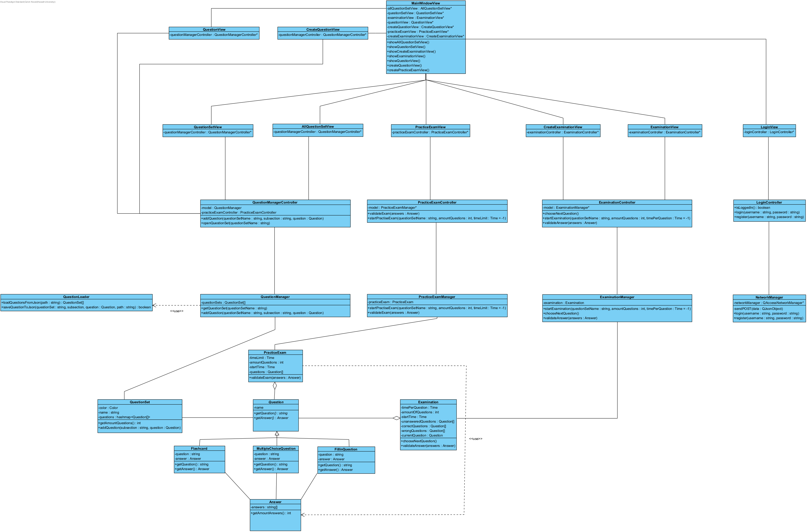

## Fully dressed use case
**Use case:** Nodig gebruikers uit tot groep

**Scope:** Applicatie GUI en backend

**Level:** User goal

**Primary Actor:** Student of Docent

**Stakeholders and interests:**
* Student en docent:

**Preconditions:** 

**Postconditions:** 

**Main Success Scenario:**

**Uitbreidingen (Alternatieve Stromen)**

**Special Requirements:** Geen

**Technology and Data Variations List:** Geen

**Frequency of Occurences:** 

## Systeemsequentiediagram

## Contracten
### **Naam:**  
**Cross References:** 
* **Use cases:**  
* **SSD’s:** 
  
**Pre-condities:**  
**Post-condities:** 
* **Instance creation:**  

---

## UML Diagrammen ontwerp

## Klassen diagram

