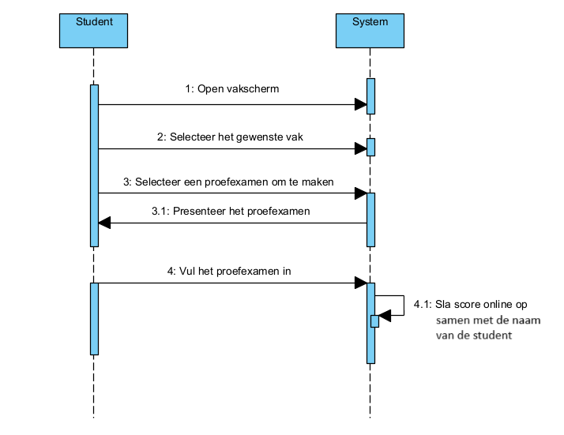

# Fully dressed use case genereer proefexamen
**Use case:** Student maakt officieel proefexamen van een vak

**Scope:** Applicatie GUI en backend

**Level:** User goal

**Primary Actor:** Student

**Stakeholders and interests:**
* Student: wilt officiele proefexamens maken die voorbereid zijn door het onderwijsteam van een vak.

**Preconditions:** Er bestaat een proefexamen in het vak

**Postconditions:** De score is online opgeslagen

**Main Success Scenario:**

1. De gebruiker selecteert een vak
2. De gebruiker selecteert een proefexamen
3. De gebruiker maakt het proefexamen op dezelfde manier als hij een zelf gegenereerd proefexamen zou maken
4. De score samen met de naam van de student wordt online opgeslagen

**Uitbreidingen (Alternatieve Stromen)**

3a. De gebruiker stopt met het proefexamen voor dit is afgemaakt
1. De score wordt niet opgeslagen

**Special Requirements:** 
De gebruiker moet online en verbonden zijn met de server

**Technology and Data Variations List:** Geen

**Frequency of Occurences:** Dit wordt regelmatig gebruikt, vooral richting de examens

## Systeem Sequentie Diagram

## Contracten

### **Naam:** Open vakscherm 
**Cross References:** 
* **Use cases:** Student maakt officieel proefexamen van een vak 
* **SSD’s:** maak officieel proefexamen
  
**Pre-condities:** De gebruiker moet ingelogd zijn op een student account 
**Post-condities:** 
* **Instance creation:** Een vakscherm instantie wordt aangemaakt

---

### **Naam:** Selecteer het gewenste vak 
**Cross References:** 
* **Use cases:** Student maakt officieel proefexamen van een vak 
* **SSD’s:** maak officieel proefexamen
  
**Pre-condities:** Er moet minstens 1 vak zijn 
**Post-condities:** 
* **Instance destruction:** Het vakscherm wordt gesloten
* **Instance creation:** Een scherm voor het specifieke vak wordt aangemaakt

---

### **Naam:** Selecteer een proefexamen om te maken 
**Cross References:** 
* **Use cases:** Student maakt officieel proefexamen van een vak 
* **SSD’s:** maak officieel proefexamen
  
**Pre-condities:** Er moet minsten 1 preofexamen in het vak zitten en het specifieke vakscherm moet open zijn 
**Post-condities:** 
* **Attribute modification:** Het proefexamen wordt opgevraagd van de server

---

### **Naam:** Presenteer het proefexamen 
**Cross References:** 
* **Use cases:** Student maakt officieel proefexamen van een vak 
* **SSD’s:** maak officieel proefexamen
  
**Pre-condities:** Het proefexamen moet opgevraagd zijn van de server 
**Post-condities:** 
* **Instance creation:** Er wordt een scherm gemaakt waar het proefexamen op te maken is

---

### **Naam:** Vul het proefexamen in 
**Cross References:** 
* **Use cases:** Student maakt officieel proefexamen van een vak 
* **SSD’s:** maak officieel proefexamen
  
**Pre-condities:** Het proefexamen maak scherm moet zichtbaar zijn 
**Post-condities:** 
* **Attribute modification:** De score wordt opgeslagen

---

### **Naam:** Sla score online op samen met de naam van de student 
**Cross References:** 
* **Use cases:** Student maakt officieel proefexamen van een vak 
* **SSD’s:** maak officieel proefexamen
  
**Pre-condities:** Het proefexamen moet voltooid zijn 
**Post-condities:** 
* **Attribute modification:** De score en naam van de student worden op de server opgeslaan
* **Instance deletion:** Het scherm waar het proefexamen op gemaakt werdt, word gesloten

---

## UML Diagrammen ontwerp
 

## Klassen diagram
