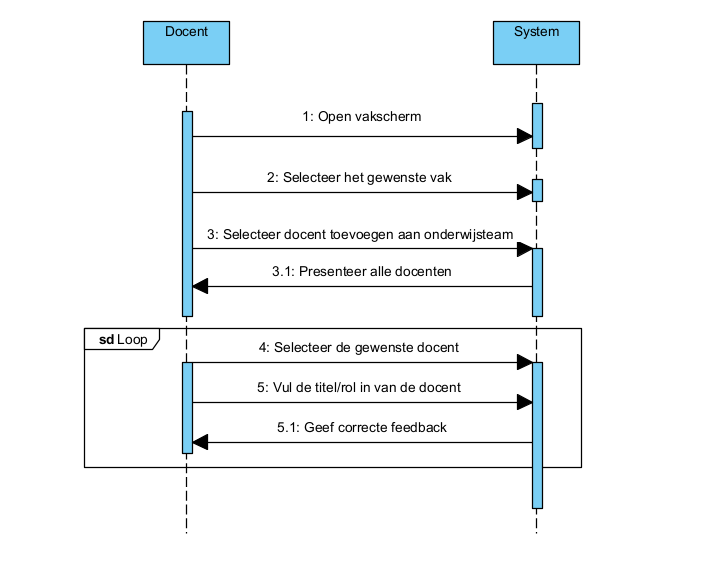
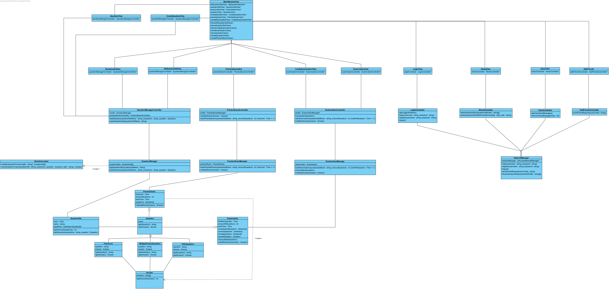

## Fully dressed use case
**Use case:** Voeg docent toe aan vak

**Scope:** Applicatie GUI en backend

**Level:** User goal

**Primary Actor:** Docent

**Stakeholders and interests:**
* Docent: wil docenten toevoegen aan het onderwijsteam van een vak

**Preconditions:** 
1. Vak dient aangemaakt te zijn
2. Docent dient deel te zijn van het onderwijsteam van het vak om andere toe te voegen

**Postconditions:** Nieuwe docent is toegevoegd aan het vak

**Main Success Scenario:**
1. De docent wilt andere docenten toevoegen aan het vak
2. De user gaat naar het vakscherm
3. De user navigeert naar het gewilde vak
4. De user selecteert de optie om docenten toe te voegen
5. De user kiest de docent uit de lijst met alle docenten
6. De user voegt de docent toe

**Uitbreidingen (Alternatieve Stromen):**   
6a. Er gaat iets mis met het toevoegen:
1. De user wordt vermeld dat er iets is fout gegaan

**Special Requirements:** 

**Technology and Data Variations List:** Geen

**Frequency of Occurences:** Laag, onderwijsteams veranderen niet vaak

## Systeemsequentiediagram

## Contracten
### **Naam:** Open vakscherm 
**Cross References:** 
* **Use cases:** Voeg docent toe aan vak 
* **SSD’s:** Voeg docent toe aan vak
  
**Pre-condities:** De gebruiker moet ingelogd zijn op een docent account 
**Post-condities:** 
* **Instance creation:** Een vakscherm instantie wordt aangemaakt

---

### **Naam:** Selecteer het gewenste vak 
**Cross References:** 
* **Use cases:** Voeg docent toe aan vak 
* **SSD’s:** Voeg docent toe aan vak
  
**Pre-condities:** Er moet minstens 1 vak zijn waar de docent toegang toe heeft 
**Post-condities:** 
* **Instance destruction:** Het vakscherm wordt gesloten
* **Instance creation:** Een scherm voor het specifieke vak wordt aangemaakt

---

### **Naam:** Selecteer docent toevoegen aan onderwijsteam 
**Cross References:** 
* **Use cases:** Voeg docent toe aan vak 
* **SSD’s:** Voeg docent toe aan vak
  
**Pre-condities:** Het scherm voor het specifieke vak moet aangemaakt zijn 
**Post-condities:** 
* **Instance creation:** Een scherm voor docenten toe te voegen wordt getoond

---

### **Naam:** Presenteer alle docenten 
**Cross References:** 
* **Use cases:** Voeg docent toe aan vak 
* **SSD’s:** Voeg docent toe aan vak
  
**Pre-condities:** Het scherm om docenten toe te voegen moet getoond zijn 
**Post-condities:** 
* **Attribute modification:** Er wordt een lijst in het scherm om docenten toe te voegen gezet waar alle docenten in staan

---

### **Naam:** Selecteer de gewenste docent 
**Cross References:** 
* **Use cases:** Voeg docent toe aan vak 
* **SSD’s:** Voeg docent toe aan vak
  
**Pre-condities:** Er moet minstens 1 docent beschikbaar zijn die niet die nog niet is toegevoegd 
**Post-condities:** 
* **Attribute modification:** De geselecteerde wordt tijdelijke opgeslagen

---

### **Naam:** Vul de titel/rol in van de docent 
**Cross References:** 
* **Use cases:** Voeg docent toe aan vak 
* **SSD’s:** Voeg docent toe aan vak
  
**Pre-condities:** Er moet een docent geselecteerd zijn 
**Post-condities:** 
* **Attribute modification:** De titel word tijdelijk opgeslagen

---

### **Naam:** Geef correcte feedback 
**Cross References:** 
* **Use cases:** Voeg docent toe aan vak 
* **SSD’s:** Voeg docent toe aan vak
  
**Pre-condities:** Er moet een docent geselcteerd zijn en een titel ingevuld en dit moet bevestigd zijn 
**Post-condities:** 
* **Instance creation:** Als er iets mis gaat of een veld niet goed is ingevuld wordt de gebruiker hiervan verwittigd
* **Instance deletion:** Het scherm voor docenten toe te voegen wordt gesloten als er geen fouten zijn

---

## UML Diagrammen ontwerp

## Klassen diagram

